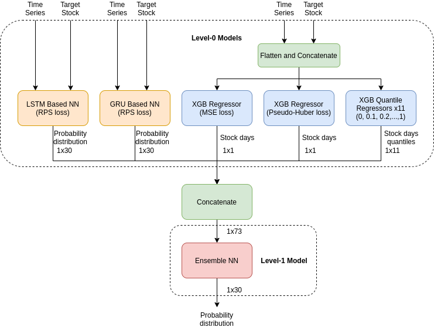

# Meli Data Challenge 2021 - First Place Solution
My solution for the [Meli Data Challenge 2021](https://ml-challenge.mercadolibre.com/).

## The Model
My final model is an ensemble combining recurrent neural networks and XGBoost regressors.
Neural networks are trained to predict the stock days probability distribution using the RPS as loss function.
XGBoost regressors are trained to predict stock days using different objectives, here the intuition behind this:
  - MSE loss: the regressor trained with this loss will output values close to the expected mean.
  - Pseudo-Huber loss: an alternative for the MAE loss, this regressor outputs values close to the expected median.
  - Quantile loss: 11 regressors are trained using a quantile loss with alpha 0, 0.1, 0.2, ..., 1. This helps to build the final probability distribution.

The outputs of all these level-0 models are concatenated to train a feedforward neural network with the RPS as loss function.



The last 30 days of the train dataset are used to generate the labels and the target stock input. The remaining 29 days are used to generate the time series input.

The train/validation split is done at a sku level:
  - For level-0 models: 450000 sku's are used for training and the rest for validation.
  - For the level-1 model: the sku's used for training level-0 models are removed from the dataset and the remaining sku's are split again into train/validation.

Once all models are trained, the last 29 days of the train dataset and the provided target stock values are used as input to generate the submission.

This solution gets a score around 3.7075 on the public dataset.

_Disclaimer: the entire solution lacks some fine tuning since I came up with this little ensemble monster towards the end of the competition. I didn't have the time to fine-tune each model (there are technically 16 models to tune if we consider each quantile regressor as an independent model)._

## How to run the solution

### Requirements
  - TensorFlow v2.
  - Pandas.
  - Numpy.
  - Scikit-learn.

CUDA drivers and a CUDA-compatible GPU is required (I didn't have the time to test this on a CPU).

Some scripts require up to 30GB of RAM (again, I didn't have the time to implement a more memory-efficient solution).

The solution was tested on Ubuntu 20.04 with Python 3.8.10.

### Downloading the dataset
Download the dataset files from https://ml-challenge.mercadolibre.com/downloads and put them into the `dataset/` directory.

On linux, you can do that by running:
```
cd dataset && wget \
https://meli-data-challenge.s3.amazonaws.com/2021/test_data.csv \
https://meli-data-challenge.s3.amazonaws.com/2021/train_data.parquet \
https://meli-data-challenge.s3.amazonaws.com/2021/items_static_metadata_full.jl
```

### Running the scripts
### All-in-one script
A convenient script to run the entire solution is provided:
```
cd src
./run-solution.sh
```
*Note: the entire process may take more than 3 hours to run.*

### Step by step
If you find trouble running the al-in-one script, you can run the solution step by step following the instructions bellow:

`cd` into the `src` directory:
```
cd src
```
Extract time series from the dataset:
```
python3 ./preprocessing/extract-time-series.py
```
Generate a supervised learning dataset:
```
python3 ./preprocessing/generate-sl-dataset.py
```
Train all level-0 models:
```
python3 ./train-all.py
```
Train the level-1 ensemble:
```
python3 ./train-ensemble.py
```
Generate the submission file and gzip it:
```
python3 ./generate-submission.py && gzip ./submission.csv
```

### Utility scripts
The `training_scripts` directory contains some scripts to train each model separately, example usage:
```
python3 ./training_scripts/train-lstm.py
```